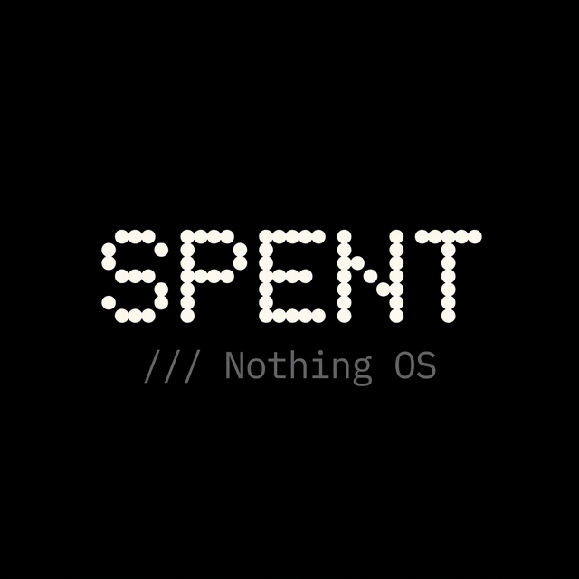
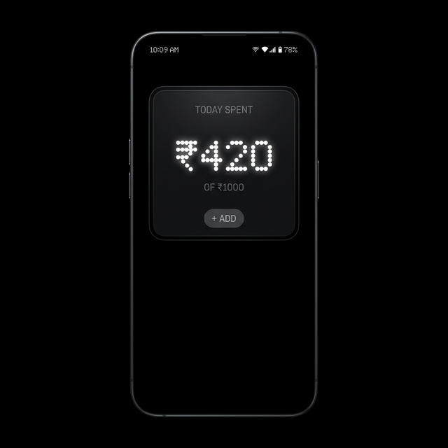
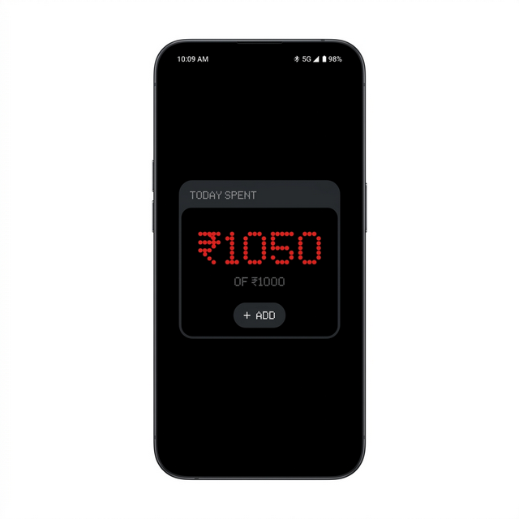

# SPENT (Minimal Daily Budget Tracker)

<p align="center">
  
</p>

<p align="center">
  <b>Budgeting apps are loud. SPENT is quiet.</b><br/>
  A single-purpose widget built during the Nothing Hackathon for the Nothing ecosystem.
</p>

<p align="center">
  
  
  
  
</p>

---

### Context

Built during the Nothing Hackathon using Nothing Playground’s AI-driven **Essential Apps** paradigm.

---

## The Concept

Most finance tools are bloated with charts, categories, and notifications you never read. SPENT removes everything unnecessary to answer one fundamental question in a single glance:

> *"How much have I spent today?"*

Most budgeting apps fail because they rely on consistency.  
SPENT assumes you won’t be consistent - and designs for that.

Designed for zero learning curve and instant feedback, SPENT runs on a strict 24-hour cycle. You set a limit. You log expenses. It resets. No history. No pressure. Just today's reality.

---

## What is an Essential App?

SPENT is an **[Essential App](https://playground.nothing.tech/apps)** - a new way of building small, focused widgets instead of full-scale apps.

Built using **[Nothing Playground](https://playground.nothing.tech)**:

* Describe what you want → AI generates the app  
* Remix existing apps or refine generated code  
* No traditional setup, just intent → widget  

This approach is what Nothing calls **"vibe coding"**.

---

## Core Behaviors

* **Frictionless Logging:** Tap, type, done. No forms or categories.
* **Emotion-Driven UI:** The interface shifts color as spending approaches the limit.
    * `Safe` ── White (#FDFBFF)
    * `Caution` ── Amber (#FFC107)
    * `Warning` ── Orange (#FF9800)
    * `Over` ── Nothing Red (#D81921)

<p align="center">
  
  &nbsp;&nbsp;&nbsp;&nbsp;
  
</p>

* **Ephemeral by Design:** A strict 24-hour reset builds awareness without guilt.
* **Smart Localization:** Automatically adapts to your local currency.

---

## Why so minimal?

Most finance apps optimize for completeness.

SPENT optimizes for consistency.

Fewer features → lower friction → higher chance you actually use it.

---

## How to Use SPENT

### 1 — Set Your Daily Limit
Enter a number (e.g., `500` for ₹500) and start your day.

### 2 — Track Spending
Your total updates instantly as you log expenses.

Color feedback:
- 🤍 White — under 80%
- 💛 Amber — 80%+
- 🟠 Orange — 90%+
- ❤️ Red — over limit

### 3 — Add an Expense
Tap **+ ADD**, enter amount, done in seconds.

### The 24-Hour Cycle
- Resets automatically after 24 hours  
- No history is stored — by design  

---

## Nothing Design Language

Built using Nothing’s design system.

### Color Palette
| Token | Hex | Usage | Preview |
| :--- | :--- | :--- | :--- |
| **Pure Black** | `#000000` | Background |  |
| **Glass Dark** | `#1B1B1D` | Surfaces |  |
| **Primary Light** | `#FDFBFF` | Text |  |
| **Secondary Dark** | `#5E5E62` | Subtle UI |  |
| **Alert Red** | `#D81921` | Over-budget |  |

### Typography
* **ndot** — Hero numbers  
* **Inter** — UI text  
* **NType82** — Branding  

*(Proprietary fonts not included — see font notice below.)*

---

## Quick Start

```bash
git clone https://github.com/Anish-Sethi-12122/SPENT.git
cd SPENT
npm install
npx expo start
```

## Architecture

* Framework: React Native / Expo SDK 52

* Language: TypeScript (Strict)

* Storage: AsyncStorage (local-only)

* Localization: expo-localization
  
```
SPENT/
│
├── App.tsx                     
├── index.js                    
│
├── src/
│   └── styles/
│       └── tokens.ts           
│
├── assets/
│   └── fonts/                 
│       ├── ndot.otf           
│       ├── Inter.ttf          
│       └── NType82.ttf        
│
├── app.json                   
├── package.json                
├── tsconfig.json           
│
├── .gitignore               
├── LICENSE              
├── README.md               
└── PROJECT_STRUCTURE.md     
```

---

## FAQ

**Q: Can I change my daily limit mid-day?**
No — it’s fixed for 24 hours to prevent adjustment bias.

**Q: What happens if I exceed my limit?**
Nothing stops you. The app reflects reality, not restrictions.

**Q: Is my data stored anywhere?**
No — everything stays on-device.

**Q: Does it work offline?**
Yes, completely offline.

**Q: Is there spending history?**
No — each day resets intentionally.

---

## Legal & Assets

License: MIT License

> Font Notice: ndot and NType82 are proprietary assets owned by Nothing Technology and Colophon Foundry. They are not included in this repository.

<p align="center"> <b>SPENT</b><br/> <i>Track less. Understand more.</i> </p> ```
